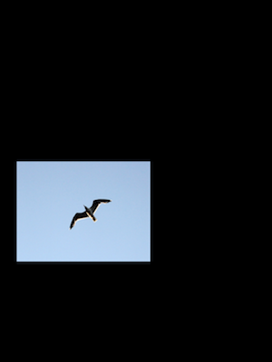

# Poisson-Blending

Image blending is the process of transferring an image from the source domain to the target domain while ensuring the transformed pixels conform to the target domain to ensure consistency. Poisson Image Blending was introduced by Perez et al. to perform seamless blending of images. The idea utilizes the sensitivity of human observers to gradients in an image. By exploiting this we obtain a Poisson equation for the solution which yields the algorithm for seamless blending.

Image 1:

Image 2:

Result:

